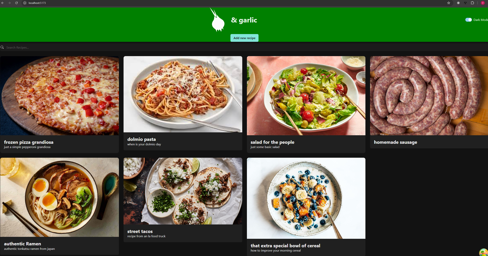

<h1 align="left">Basic recipebook fullstack project</h1>

###

<h2 align="left">Built with: React, Node.js, Express, MicrosoftSQLServer</h2>

###

  
  
  
  
  
  
  

###

<h2 align="left">Why did I make the choices I made</h2>

###

<strong><u>Frontend:</u></strong>  React: I decided on react because it's used a lot in the industry, and as an new and up-and-coming developer it had a lot of documentation and a massive community to help if I needed it.  Typescipt: I chose to use typescript for the fact that a lot of the industry uses typescript and it helps with uniformity over a bigger project and I just wanted to learn it.  Chakra-UI: Used as a way to minimize  the CSS needed to be written as it contains React Components that have some basic styling to them.  Tanstack/react-query: Use as a light weight and more beginner friendly option to Redux, used for fetching and handling the data send to the API.  Axios: Used for the ease of it compared to using standard fetch.  <strong><u>Backend:</u></strong>  Node.js: As I was new to react it seemed easiest to use a backend that used JavaScript when building the backend for the app and I had some familiarity with node.js from earlier.  Express: Was the fastest way to set up a server and I had had already dabbled with it before  Mssql: I was the first one I found that served the purpose of connecting to my database.  Why did you not do X:  this is meant to be a minimal viable product that I could show of to let's say a client. So it has the basic functionality to make it work for that. As for most other question I had learned or practiced it before where or I did not know about X until later  Why is the backend in JavaScript and the Frontend in Typescript:   I decided on learning typescript after a lot of the backend was already completed and I wanted to see how typescript would mesh with plain javaScript as a way to somewhat use "different" programming languages.

###

<h2 align="left">Some pictures of the application</h2>

###
